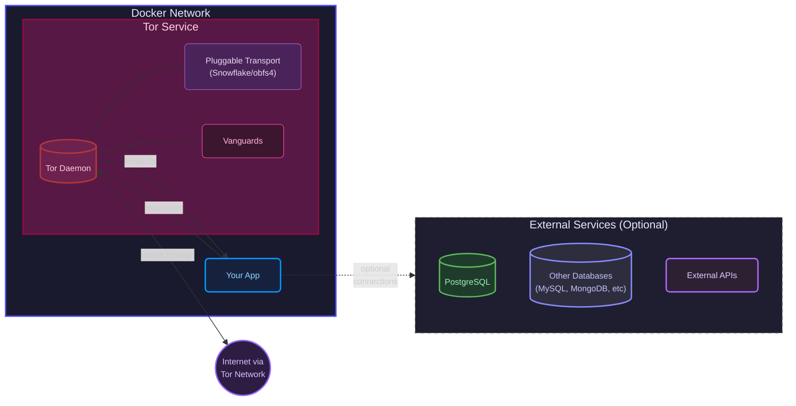

```
             @@@@@                                                                
       @@@@@@@@@@@@@@@@@                                                          
    @@@@@@@@@@@@@@@   @@@@@                                                       
  @@@@@@@@@@@@@@ @@@@@@  @@@@                                                     
 @@@@@@@@@@@@@@@@@@  @@@@  @@@   .d88b.       w             888b.            8    
 @@@@@@@@@@@@@@@ @@@@  @@@ @@@   8P  Y8 8d8b. w .d8b. 8d8b. 8   8 .d8b. .d8b 8.dP 
@@@@@@@@@@@@@@@@   @@  @@@  @@@  8b  d8 8P Y8 8 8' .8 8P Y8 8   8 8' .8 8    88b  
 @@@@@@@@@@@@@@@ @@@@  @@@ @@@   `Y88P' 8   8 8 `Y8P' 8   8 888P' `Y8P' `Y8P 8 Yb 
 @@@@@@@@@@@@@@@@@@  @@@@ @@@@   ~- By TN3W: https://github.com/tn3w/OnionDock -~ 
  @@@@@@@@@@@@@@@@@@@@@  @@@                                                      
    @@@@@@@@@@@@@@@   @@@@@                                                       
       @@@@@@@@@@@@@@@@@                                                          
```

**OnionDock** is a turnkey solution for deploying web applications as Tor hidden services with enhanced security, reliability, and performance.


## Table of Contents

- [Overview](#overview)
- [Features](#features)
- [Architecture](#architecture)
- [Getting Started](#getting-started)
  - [Prerequisites](#prerequisites)
  - [Quick Start](#quick-start)
  - [Docker Hub Images](#docker-hub-images)
- [Usage](#usage)
  - [Deploy Your Own Application](#deploy-your-own-application)
  - [Configure Hidden Service Ports](#configure-hidden-service-ports)
  - [Add a Load Balancer](#add-a-load-balancer)
  - [Add a Database Service](#add-a-database-service)
- [Configuration](#configuration)
  - [Security Levels](#security-levels)
  - [Pluggable Transports](#pluggable-transports)
  - [Advanced Tor Configuration](#advanced-tor-configuration)
  - [Vanguards Configuration](#vanguards-configuration)
- [Building from Source](#building-from-source)
  - [Installing Prerequisites](#installing-prerequisites)
  - [Building Standard Image](#building-standard-image)
  - [Building Tor from Source](#building-tor-from-source)
- [Development](#development)
  - [Code Formatting](#code-formatting)
  - [Project Structure](#project-structure)
- [Security Considerations](#security-considerations)
  - [Best Practices for Using Bridges](#best-practices-for-using-bridges)
- [Contributing](#contributing)
- [License](#license)
- [Acknowledgments](#acknowledgments)

## Overview

OnionDock provides a pre-configured Docker environment with a hardened Tor instance that includes security enhancements from the official [Vanguards](https://github.com/mikeperry-tor/vanguards) project. It enables developers to quickly deploy their web applications on the Tor network with minimal configuration while maintaining strong security practices.

## Features

- **Secure Tor Configuration**: 
  - Hardened Tor instance with security best practices
  - Automatically rotates guard nodes to prevent long-term correlation attacks
  - Includes protection against many common Tor attacks
  - **Pluggable Transports**: Support for obfs4 and Snowflake transports to improve resistance against traffic analysis and censorship

- **Official Security Enhancements**:
  - **Vanguards**: Protection against guard discovery attacks
  - **BandGuard**: Mitigation of bandwidth side-channel attacks
  - **RendGuard**: Protection against rendezvous point enumeration attacks
  - **CbtVerify**: Detection of circuit build time anomalies
  - **DropTimeouts**: Dropping circuits that timeout in certain states
  - **Bridge Support**: Protection against network-level attackers and traffic correlation through obfs4 and Snowflake with optimized IAT (Inter-Arrival Time) modes

- **Performance Optimized**: 
  - Automatic multi-threading for improved Tor performance
  - Parallel execution of Vanguards components for better CPU utilization
  - Dockerized environment for consistent resource allocation
  - Runs Vanguards using PyPy for significantly enhanced performance

- **Easy Integration**: 
  - Simple port sharing between your web application and the Tor hidden service
  - Compatible with any containerized web application
  - Plug-and-play with existing Docker Compose setups

- **Modular Design**: 
  - Easily add your own web applications, load balancers, Redis, or other services
  - Supports complex multi-container architectures
  - Extensible for various deployment scenarios

- **Docker-based**: 
  - Containerized for consistent deployment across environments
  - Version-controlled dependencies
  - Simplified setup and teardown

## Architecture

OnionDock consists of the following components:

- **Tor Service**: A hardened Tor instance with enhanced security modules
  - **Pluggable Transport Layer**: Optional obfs4 or Snowflake transports for improved traffic obfuscation and censorship resistance
- **Vanguards Addon**: 
  - Official security implementation from the [Vanguards](https://github.com/mikeperry-tor/vanguards) project
  - Components (Vanguards, BandGuards, RendGuards) run in parallel processes for better performance
- **Network Bridge**: Connects your application containers to the Tor service
- **Volume Mounts**: For persistence of Tor keys and configurations

**Simplified Architecture Diagram:**



**Vanguards Integration**

OnionDock includes the official [Vanguards](https://github.com/mikeperry-tor/vanguards) security enhancements for Tor, running on PyPy for improved performance. The Vanguards suite provides protection against various attacks on Tor hidden services:

- **How it works in OnionDock:**
  - Runs multiple security components in parallel for better resource utilization
  - Configurable security levels (high/medium/low) via `SECURITY_LEVEL` environment variable
  - In high security mode (default), all three modules run simultaneously:
    - **Vanguards Module**: Protects against guard discovery attacks
    - **BandGuards Module**: Mitigates bandwidth side-channel attacks
    - **RendGuards Module**: Protects against rendezvous point enumeration

The Tor service is hardened with these security enhancements while maintaining compatibility with any containerized web application, providing strong security with minimal configuration.

**Pluggable Transports**

OnionDock integrates pluggable transports to enhance resistance against network-level adversaries and traffic analysis:

- **How it works in OnionDock:**
  - Configurable transport type via `TOR_TRANSPORT_TYPE` environment variable
  - Automatically configures and optimizes bridge connections
  - Enforces recommended security settings (like IAT mode 2 for obfs4)
  - Provides additional protection layers against traffic correlation attacks

## Getting Started

### Prerequisites

- Docker and Docker Compose installed on your system
- Basic understanding of Docker containers and networks

### Docker Hub Images

OnionDock is available as pre-built Docker images on Docker Hub. This is the recommended way to use OnionDock.

**Standard Image** (with packaged Tor):
```bash
docker pull tn3w/oniondock:latest
```

**From-Source Image** (with Tor built from source for enhanced security):
```bash
docker pull tn3w/oniondock:from-source
```

### Quick Start

Follow these steps to deploy the example application using the Docker Hub image:

1. **Clone this repository**:
   ```bash
   git clone https://github.com/tn3w/OnionDock.git
   cd OnionDock/example
   ```

2. **Build and start the services**:
   ```bash
   docker compose up -d
   ```

3. **Get your Tor hidden service address**:
   ```bash
   docker compose logs tor | grep "Tor hidden service"
   ```

   You should see output similar to:
   ```
   [+] Tor hidden service at: abcdefghijklmnopqrstuvwxyz234567.onion
   ```

4. **Access your hidden service**:
   
   Open the Tor Browser and navigate to the onion address shown in the previous step.

**All-in-one command**:
```bash
git clone https://github.com/tn3w/OnionDock.git && \
cd OnionDock/example && \
docker compose up -d && \
sleep 10 && \
docker compose logs tor | grep "Tor hidden service"
```

### Cleaning Up

To stop and remove all containers:

```bash
docker compose down
```

## Usage

### Deploy Your Own Application

To deploy your own application with OnionDock, follow these steps:

1. **Create a project structure**:
   ```
   your-project/
   ├── app/
   │   ├── Dockerfile
   │   └── your-application-files
   ├── data/
   │   └── tor/
   │       └── hidden_service/  # This will be created automatically
   └── docker-compose.yml
   ```

2. **Create your docker-compose.yml**:
   ```yaml
   services:
     tor:
       image: tn3w/oniondock:latest  # Use the Docker Hub image
       environment:
         # Format: TOR_PORT:SERVICE_NAME:SERVICE_PORT
         # Multiple services can be comma-separated
         - TOR_SERVICE_PORTS=80:your-app-service:3000
         # Optional: Set the transport type (none, snowflake, obfs4)
         - TOR_TRANSPORT_TYPE=snowflake
         # Optional: Set the security level (high, medium, low)
         - SECURITY_LEVEL=high
       volumes:
         - ./data/tor/hidden_service:/var/lib/tor/hidden_service:rw
       restart: unless-stopped
       networks:
         - onion_network
       depends_on:
         - your-app-service
   
     your-app-service:
       build:
         context: ./app
       # If your app listens on port 3000 internally:
       environment:
         - PORT=3000  # The port your application listens on
       networks:
         - onion_network
       restart: unless-stopped
   
   networks:
     onion_network:
       driver: bridge
   ```

3. **Start your services**:
   ```bash
   docker compose up -d
   ```

4. **Get your Tor hidden service address**:
   ```bash
   docker compose logs tor | grep "Tor hidden service"
   ```

### Configure Hidden Service Ports

OnionDock makes it easy to configure port mappings between your Tor hidden service and your application services using the `TOR_SERVICE_PORTS` environment variable.

The format is: `TOR_PORT:SERVICE_NAME:SERVICE_PORT`

For multiple port mappings, separate them with commas:

```yaml
services:
  tor:
    image: tn3w/oniondock:latest
    environment:
      # Map multiple services and ports
      - TOR_SERVICE_PORTS=80:web-app:8080,8888:admin-panel:3000,22:ssh-service:22
    # ...other configuration
```

This configuration will:
- Map port 80 on your .onion address to port 8080 on the web-app service
- Map port 8888 on your .onion address to port 3000 on the admin-panel service
- Map port 22 on your .onion address to port 22 on the ssh-service service

## Configuration

### Security Levels

OnionDock can be customized through environment variables:

- `SECURITY_LEVEL`: Level of security guards (default: high)
  - `high`: All security components enabled, running in parallel
  - `medium`: Basic security components without circuit build time verification
  - `low`: Minimal security with only vanguards layer protection

Example docker-compose.yml with security configuration:
```yaml
services:
  tor:
    image: oniondock:latest
    environment:
      - SECURITY_LEVEL=high  # Options: high, medium, low
      - TOR_SERVICE_PORTS=80:webapp:8080
    # ...other configuration
```

### Pluggable Transports

OnionDock supports pluggable transports to enhance protection against traffic analysis and network-level adversaries. This is configured through the `TOR_TRANSPORT_TYPE` environment variable.

- `TOR_TRANSPORT_TYPE`: Type of pluggable transport to use (default: snowflake)
  - `none`: No pluggable transport, direct Tor connection
  - `snowflake`: Use Snowflake bridges for additional protection against traffic analysis and correlation attacks
  - `obfs4`: Use obfs4 for enhanced traffic obfuscation with IAT (Inter-Arrival Time) protections
  - `conjure`: Experimental support for Conjure transport

Example docker-compose.yml with transport configuration:
```yaml
services:
  tor:
    image: oniondock:latest
    environment:
      - TOR_SERVICE_PORTS=80:webapp:8080
      - TOR_TRANSPORT_TYPE=obfs4  # Options: none, snowflake, obfs4, conjure
    # ...other configuration
```

**Transport Type Comparison:**

| Transport | Traffic Analysis Protection | Connection Resilience | Correlation Attack Resistance | Good For |
|-----------|----------------------------|---------------------|---------------------------|----------|
| none      | ❌ None                     | ❌ Basic             | ❌ Vulnerable               | Lower latency when advanced security is not a concern |
| snowflake | ⚠️ Basic                   | ✅ Excellent        | ✅ Good                     | Protection against connection disruption attacks, can resume through different paths |
| obfs4     | ✅ Excellent (with IAT=2)   | ⚠️ Limited          | ✅ Excellent                | Protection against sophisticated traffic analysis, timing attacks, and fingerprinting |
| conjure   | ⚠️ Basic                   | ⚠️ Basic            | ⚠️ Basic                   | Experimental use cases with specialized needs |

OnionDock automatically configures the optimal settings for each transport, including:
- For obfs4: Setting iat-mode=2 for maximum protection against timing analysis
- For snowflake: Using optimized connection parameters for resiliency against disruption attacks

### Advanced Tor Configuration

For advanced Tor configuration beyond port mapping, you can still mount a custom torrc file:

```yaml
services:
  tor:
    image: oniondock:latest
    environment:
      - TOR_SERVICE_PORTS=80:webapp:8080,8888:admin:3000
    volumes:
      - ./data/tor/hidden_service:/var/lib/tor/hidden_service:rw
      - ./tor/custom-torrc:/etc/tor/torrc:ro
    # ...other configuration
```

Example advanced torrc settings:

```
# Core Tor configuration
DataDirectory /var/lib/tor
ControlPort 9051
CookieAuthentication 1

# Security enhancements
StrictNodes 1
EnforceDistinctSubnets 1
WarnUnsafeSocks 1
```

> **Note**: When using a custom torrc file, make sure it includes the line `# PORTS` where the port configurations should be inserted. Port mappings are dynamically generated from the `TOR_SERVICE_PORTS` environment variable.

### Vanguards Configuration

OnionDock includes a pre-configured `vanguards.conf` with balanced security settings. For high-risk services like whistleblower sites or sites facing state-level adversaries, we provide a maximum security configuration in `vanguards-max-security.conf`.

**To use maximum security settings:**
```bash
# When using your own volume mounts
cp tor/config/vanguards-max-security.conf tor/config/vanguards.conf
```

**Key Configuration Parameters:**

- **[Global]**
  - `control_ip`: Tor control connection IP (default: 127.0.0.1)
  - `control_socket`: Path to Unix socket for Tor control (empty = use IP+port instead)
  - `control_pass`: Password for Tor control authentication (empty = cookie auth)
  - `enable_logguard`: Enables logging protection (true/false)
  - `close_circuits`: Automatically closes suspicious circuits
  - `enable_pathverify`: Verifies path selection to detect manipulation
  - `one_shot_vanguards`: Regenerates guards on restart
  - `loglevel`: Log verbosity level (NOTICE, INFO, DEBUG)

- **[Vanguards]**
  - `layer1_lifetime_days`: How often to rotate entry guards (lower = more secure)
  - `max_layer2_lifetime_hours`: Maximum time to keep middle-layer guards
  - `max_layer3_lifetime_hours`: Maximum time to keep exit-layer guards
  - `min_layer2_lifetime_hours`: Minimum time before replacing middle-layer guards
  - `min_layer3_lifetime_hours`: Minimum time before replacing exit-layer guards
  - `num_layer1_guards`: Number of entry guards (more = more secure)
  - `num_layer2_guards`: Number of middle-layer guards (more = more secure)
  - `num_layer3_guards`: Number of exit-layer guards (more = more secure)

- **[Bandguards]**
  - `circ_max_age_hours`: Maximum circuit lifetime (lower = more secure)
  - `circ_max_hsdesc_kilobytes`: Maximum descriptor download size before circuit closure
  - `circ_max_serv_intro_kilobytes`: Maximum intro point traffic before circuit closure  
  - `circ_max_megabytes`: Bandwidth limits for circuits (lower = more secure)
  - `circ_max_disconnected_secs`: Closes circuits after this many seconds of disconnection
  - `conn_max_disconnected_secs`: Closes connections after this many seconds of disconnection

- **[Rendguard]**
  - `rend_use_max_use_to_bw_ratio`: Limits excessive use of rendezvous points
  - `rend_use_max_consensus_weight_churn`: Limits changes in consensus weight
  - `rend_use_close_circuits_on_overuse`: Closes circuits when rendezvous points are overused
  - `rend_use_global_start_count`: Minimum consensus count before enabling protections
  - `rend_use_relay_start_count`: Minimum relay consensus count before monitoring
  - `rend_use_scale_at_count`: Consensus count threshold for scaling protection

- **[Logguard]**
  - `log_protocol_warns`: Enables warning on protocol anomalies
  - `log_dump_limit`: Maximum number of log lines to dump on anomaly detection
  - `log_dump_level`: Verbosity of logs (NOTICE or DEBUG in max security)

> **Security Note**: High-risk services like whistleblower sites, dissident platforms, or sites facing state-level adversaries should use the max security configuration. This offers significantly stronger protection against sophisticated attackers at the cost of some performance.

## Building from Source

If you prefer to build the OnionDock images locally rather than using the pre-built Docker Hub images, follow these instructions.

### Installing Prerequisites

#### Installing Prerequisites on Ubuntu

```bash
# Update package lists
sudo apt update && sudo apt upgrade -y

# Install Git
sudo apt install -y git

# Install Docker prerequisites
sudo apt install -y ca-certificates curl gnupg

# Install Docker GPG key
sudo install -m 0755 -d /etc/apt/keyrings
sudo curl -fsSL https://download.docker.com/linux/ubuntu/gpg -o /etc/apt/keyrings/docker.asc
sudo chmod a+r /etc/apt/keyrings/docker.asc

# Create Docker repository configuration
echo "deb [arch=$(dpkg --print-architecture) \
     signed-by=/etc/apt/keyrings/docker.asc] \
     https://download.docker.com/linux/ubuntu \
     $(. /etc/os-release && echo "${UBUNTU_CODENAME:-$VERSION_CODENAME}") \
     stable" | sudo tee /etc/apt/sources.list.d/docker.list > /dev/null

# Update package lists with new repository
sudo apt-get update

# Update and install Docker
sudo apt update
sudo apt install -y docker-ce docker-ce-cli containerd.io docker-buildx-plugin docker-compose-plugin

# Add current user to docker group (no need for sudo with docker commands after logout/login)
sudo usermod -aG docker $USER
sudo systemctl enable --now docker

# Log out and log back in for group changes to take effect, or run:
# newgrp docker
```

### Building Standard Image

Build the standard OnionDock image with packaged Tor:

```bash
git clone https://github.com/tn3w/OnionDock.git
cd OnionDock
DOCKER_BUILDKIT=1 docker build -t oniondock -f tor/Dockerfile tor/
```

### Building Tor from Source

For enhanced security or to use the latest Tor version, you can build Tor from source:

```bash
git clone https://github.com/tn3w/OnionDock.git
cd OnionDock
DOCKER_BUILDKIT=1 docker build -t oniondock-from-source -f tor/Dockerfile.tor-from-source tor/
```

> **Note**: Building Tor from source takes significantly longer than using the packaged version. Be patient during the build process.

## Development

### Code Formatting

To format shell scripts in the project:

```bash
# Setup Python environment
python3 -m venv venv
source venv/bin/activate
python3 -m ensurepip

# Install formatting tools
python3 -m pip install beautysh setuptools

# Format all shell scripts
find . -name "*.sh" -exec beautysh {} \;
```

### Project Structure

The project is organized as follows:

```
OnionDock/
├── tor/                      # Tor service configuration
│   ├── config/               # Tor and Vanguards configuration files
│   │   ├── torrc             # Default Tor configuration 
│   │   └── vanguards.conf    # Vanguards configuration
│   ├── Dockerfile            # Docker image with packaged Tor
│   ├── Dockerfile.tor-from-source  # Docker image building Tor from source
│   ├── start.sh              # Tor startup script
│   └── entrypoint.sh         # Docker entrypoint script
├── example/                  # Example application
│   ├── app/                  # Example web application 
│   │   ├── Dockerfile        # Application container definition
│   │   ├── app.py            # Sample web app
│   │   └── ...
│   ├── data/                 # Persistent data directory
│   └── docker-compose.yml    # Example compose file
├── docker-compose.yml        # Base compose file
└── README.md                 # This file
```

## Security Considerations

- **OnionDock Security Scope**: OnionDock enhances Tor's security but is not a silver bullet for all security concerns.
- **Application Security**: Always follow security best practices for your web application; OnionDock only secures the transport layer.
- **Updates**: Keep Docker, Tor, and all components updated to the latest versions to minimize security vulnerabilities.
- **Defense in Depth**: Consider adding additional security layers specific to your application's needs.
- **Isolation**: Run OnionDock on dedicated hardware when possible, especially for sensitive applications.
- **Backup**: Regularly backup your hidden service keys in a secure location.
- **Monitoring**: Implement monitoring to detect unusual patterns or potential attacks.

### Best Practices for Using Bridges

Using bridges is a critical security enhancement for Tor hidden services that provides additional protection against traffic analysis by both local and global adversaries.

#### Why Use Bridges

Tor has basic defenses against traffic analysis, but pluggable transports and bridges provide additional protection:

- **Protection Against Correlation Attacks**: Prevents adversaries from confirming service identity by disrupting connections and monitoring service availability
- **Traffic Analysis Resistance**: Certain bridges (especially obfs4 with IAT mode 2) add obfuscation to make traffic analysis more difficult
- **Network Adversary Protection**: Makes it harder for local network observers to identify that you're running a Tor hidden service
- **Improved Circuit Resilience**: Using Snowflake can protect against attacks where an adversary blocks or disrupts Tor circuits

#### Transport Types in OnionDock

OnionDock supports multiple transport types, each with unique security properties:

1. **Snowflake (Default)**:
   - **Strengths**: Resilient against circuit disruption; can resume circuits via other bridges if one is blocked; excellent at maintaining service availability
   - **Considerations**: Bridges may have limited capacity; less traffic analysis protection than obfs4
   - **Best For**: Protection against connection disruption attacks, situations where service reliability is critical

2. **obfs4**:
   - **Strengths**: Enhanced traffic analysis resistance with IAT mode 2 (enforced in OnionDock); harder for adversaries to use bandwidth side channels and timing attacks
   - **Considerations**: Less resilient to connection disruption than Snowflake
   - **Best For**: Protection against sophisticated traffic analysis; environments where traffic pattern obfuscation is critical

3. **none** (direct Tor connection):
   - **Strengths**: Lower latency, simpler configuration
   - **Considerations**: No additional protection against traffic analysis or correlation attacks
   - **Best For**: Testing or environments where external adversaries are not a concern

#### How OnionDock Implements Bridges

OnionDock automatically sets up the optimal configuration for each transport type:

- For **obfs4**: OnionDock enforces iat-mode=2, which is the recommended setting for hidden services as it injects traffic timing changes to outgoing traffic
- For **Snowflake**: OnionDock configures the connection parameters for optimal resilience against circuit disruption
- Bridge selection is randomized from a curated list to distribute load and enhance security

#### When to Use Which Transport

- **High-Risk Services** (whistleblower platforms, dissident websites):
  - Use `obfs4` with `SECURITY_LEVEL=high` for maximum protection against traffic analysis
  - Consider running your own bridges in addition to using OnionDock

- **Services Requiring High Availability**:
  - Use `snowflake` for maximum resilience against circuit disruption attacks
  - Combine with a high security level for critical services

- **Low-Risk or Testing Services**:
  - `none` may be sufficient for development or services with minimal security concerns

- **Enterprise or High-Traffic Services**:
  - Consider using `obfs4` with a medium security level to balance performance and security

## Contributing

Contributions are welcome! Please feel free to submit a Pull Request.

1. Fork the repository
2. Create your feature branch (`git checkout -b feature/amazing-feature`)
3. Commit your changes (`git commit -m 'Add some amazing feature'`)
4. Push to the branch (`git push origin feature/amazing-feature`)
5. Open a Pull Request

## License

Copyright 2025 TN3W

Licensed under the Apache License, Version 2.0 (the "License");
you may not use this file except in compliance with the License.
You may obtain a copy of the License at

    http://www.apache.org/licenses/LICENSE-2.0

Unless required by applicable law or agreed to in writing, software
distributed under the License is distributed on an "AS IS" BASIS,
WITHOUT WARRANTIES OR CONDITIONS OF ANY KIND, either express or implied.
See the License for the specific language governing permissions and
limitations under the License.

## Acknowledgments

- The Tor Project for their incredible work on anonymity technology
- Mike Perry and the Tor Project for the [Vanguards](https://github.com/mikeperry-tor/vanguards) implementation
- The security researchers who developed these security concepts
- The Docker team for container technology that makes this project possible 